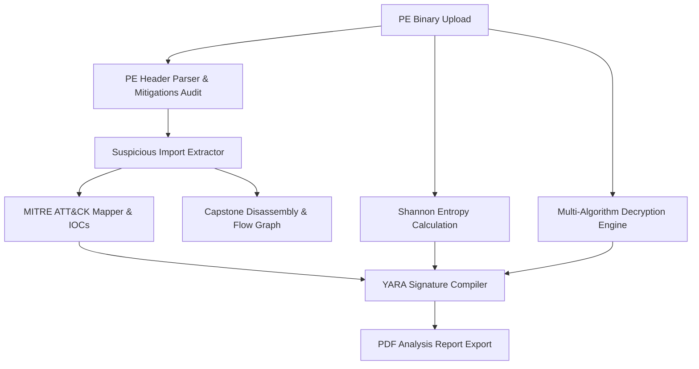

# 🛡️ AegisStatic: Advanced Static Triage & Payload De-Obfuscation Engine

AegisStatic is a premium, production-grade static binary triage and de-obfuscation engine designed for security analysts, malware researchers, and reverse engineers. It parses Windows PE binaries (executables, DLLs, system drivers) to extract indicators of compromise (IOCs), map suspicious APIs to the MITRE ATT&CK framework, detect and brute-force obfuscated payloads, and output ready-to-deploy YARA rules.

The application features a modern, responsive user interface with a custom-engineered **unified theme toggle** (Light/Dark mode coordination) and interactive data visualizations.

---

## 🚀 Key Features

* **PE Mitigation & Header Audit**: Instantly extract compiler details, PE sections, and security mitigations (ASLR, DEP/NX, SafeSEH, Control Flow Guard, and Authenticode signatures).
* **Shannon Entropy Analysis**: Visualizes section entropy metrics using interactive Plotly bar charts to locate packed, compressed, or encrypted resource sections.
* **Payload De-Obfuscation**: Employs heuristic brute-forcing to decrypt payloads obfuscated via 1-byte or 2-byte XOR, Base64 encoding, or ROT13 rotation, matching against predefined signature databases.
* **MITRE ATT&CK Mapping**: Compares suspicious API imports against threat behaviors to map binary capabilities to MITRE ATT&CK tactics (e.g., Defense Evasion, Persistence, Execution).
* **Interactive Disassembly & Control Flow Mapping**: Interactive Capstone-powered disassembly viewer coupled with NetworkX-rendered function control flow graphs.
* **Automated YARA Rule Generator**: Compiles extracted strings, high-entropy sections, and suspicious imports into structured YARA rules.
* **MalwareBazaar Integration**: Automates hash signature lookups to detect known threat profiles.

---

## 🛠️ System Architecture & Pipeline



---

## ⚙️ Installation & Running Steps

### Prerequisites
* Python 3.9 or higher
* `pip` package manager

### 1. Clone the Repository
```bash
git clone https://github.com/<your-username>/AegisStatic.git
cd AegisStatic
```

### 2. Configure Virtual Environment
```bash
python3 -m venv .venv
source .venv/bin/activate
```

### 3. Install Dependencies
```bash
pip install -r requirements.txt
```

### 4. Run the Dashboard
```bash
streamlit run app.py
```
Open `http://localhost:8501` in your browser to access the dashboard.

---

## 📦 Required Dependencies

Defined in `requirements.txt`:
* `streamlit`: Fast reactive dashboard wrapper.
* `pefile`: Portable Executable parsing library.
* `capstone`: Multidisciplinary disassembly framework.
* `plotly`: High-fidelity interactive charts.
* `networkx`: Complex network structure calculations.
* `reportlab`: PDF report generation layout tool.

---

## 📄 License

This project is licensed under the MIT License - see the LICENSE file for details.
